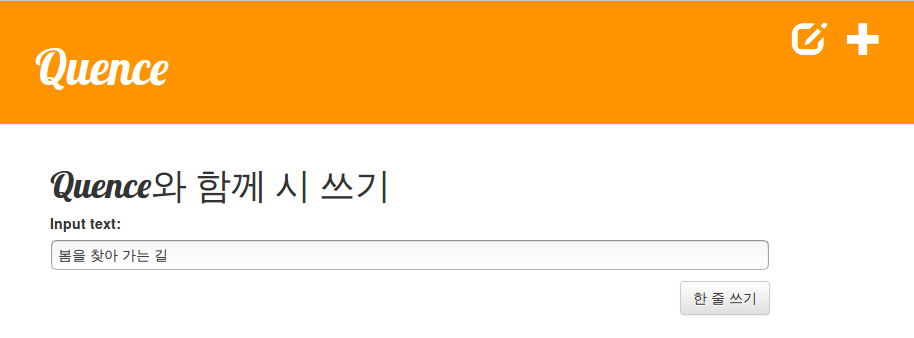

# Quence

Sequence to Sequence 모델을 사용한 인공지능 시 짓기 체험 웹페이지

## 사용 방법

1. `+` 버튼을 눌러 새롭게 시를 작성할 수 있다. 사용자는 시의 첫 행을 입력해야 한다.

    

2. `한 줄 쓰기` 버튼을 누르면 사용자의 입력이 인공지능 모델에 전달된다. 이 모델은 사용자가 입력한 문장에 어울리는 다음 행을 3가지 생성한다.

    

3. 사용자는 추천된 3가지 중 원하는 행을 선택할 수 있다. 선택된 행이 다음 행으로 저장된다.

    

4. 계속 시 짓기를 원하면 `만들기` 버튼을 누른다. 모델은 이전 행을 입력으로 받아 다시 3가지 추천 결과를 생성한다.

    

5. 사용자는 다시 원하는 행을 선택할 수 있다.

    

6. 시가 완성되었다면 `출판하기` 버튼을 누른다. 이제 시작 페이지에서 완성된 시를 확인할 수 있다.

    